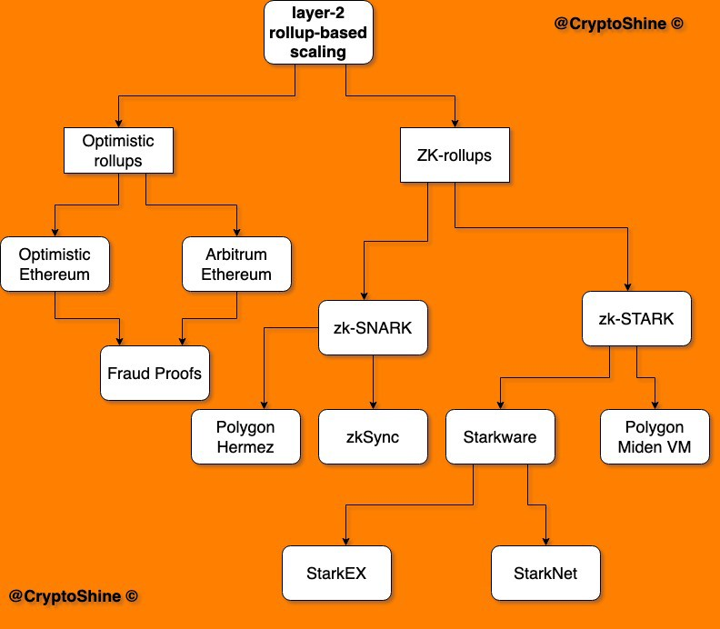

# 概览

## 为什么需要 Scaling

References:

- [What is Layer 2 Scaling Solutions & Why It Is Required?](https://medium.com/crypto-wisdom/what-is-layer-2-scaling-solutions-why-it-is-required-66b8dbf3bc9c)

- [An Introduction to Cross Layer Transfer](https://medium.com/onther-tech/an-introduction-to-cross-layer-transfer-af7e7183c0b9)

- [Blockchain Scalability](https://medium.com/iovlabs-innovation-stories/blockchain-scalability-4dce74382930)

## 简介

性能概览:

|Solutions|TPS|
|-|-|
|State Channels|10,000|
|Plasma|7,200|
|ZK Rollup|4,500|
|Optimistic Rollup|800|

Rollups 方案的分类：

References:

- [SCALING](https://ethereum.org/en/developers/docs/scaling/)
- [Layer 2 Blockchain Scaling: a Survey](https://arxiv.org/pdf/2107.10881.pdf)

