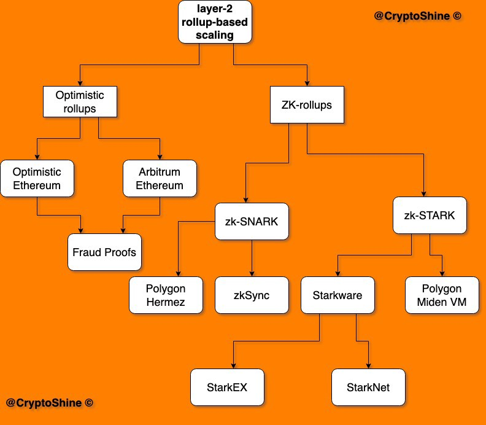

# 概览

## 性能概览

|Solutions|TPS|
|-|-|
|State Channels|10,000|
|Plasma|7,200|
|ZK Rollup|4,500|
|Optimistic Rollup|800|

## Rollup

这是 rollups 方案的分类：

## References

- [SCALING](https://ethereum.org/en/developers/docs/scaling/)
- [Layer 2 Blockchain Scaling: a Survey](https://arxiv.org/pdf/2107.10881.pdf)

