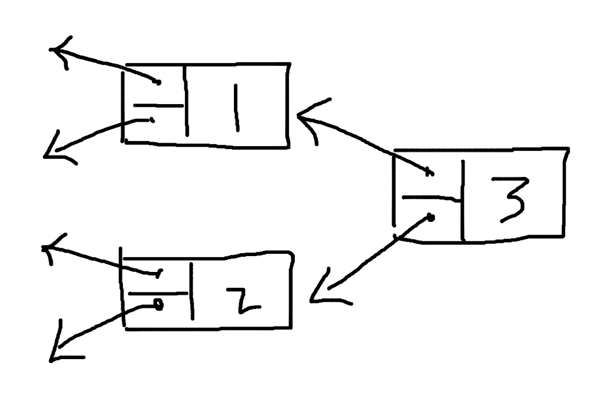

# 基于 Multi-linked list 的区块链

区块链有没有可能不再是线性的结构，而是有多条链路的、图式的数据结构呢，比如从 singly-linked list 进化到 multi-linked list。假设是 mul ti-linekd list 的形式，会给区块链带来什么样的变化，或者说，可行吗？

首先是正向的 multi-linked list，像是这样：

然后是适用于区块链的、反向的 multi-linked list，像这样：

对于 multi-lineked list，一种是固定数量的情况，比如每个节点的后续节点一定是 2 个，或者是不固定数量的 multi-linked list，每个节点可以指向任意多个子节点，它们的区别不大。

还有一个分歧是要不要保留块高度的概念，块高度是用来表示块顺序的索引，在多个节点之间同步数据的时候起到很重要的作用，在 multi-linked list 中，如果按照树结构层数来定义块高度，会是这样：

或者可以按照块写入的顺序定义，也就是初始的标号意味着块高度：

对于区块链来说，很重要的是确认数据的完整性，当只有一个子节点的时候，其他节点很容易同步一个块的数据，并且根据 hash values 校验块的有效性。对于 multi-linked list 的情形，这个校验块数据的步骤会复杂一些，但也并非无法处理，只要把原先校验一个块的操作，多几次循环，多校验几次就可以了。

正向和反向 multi-linked list 最大的区别是，一种是向外发散的，会随着层级的增大，每一层容纳的节点数不断增大，指数级增长。另一种是收敛的，每一层的节点数会不断减少，最终只剩下一个。也就是正着的树和倒着的树的区别。

区块链中有一个创始块的概念，如果是正向的 multi-linked list，创世块还是一个保持不变，但是子节点逐渐膨胀以后，会越来越不可控。对于保留块高度的情况，其实除了程序处理多几个步骤，并没有无法实现的理由。对于不保留块高度或者说用索引值代替块高度的情况，块仍然可以一个一个地出，也没有在技术上实现不了的理由，但其实还是链式结构的处理方式。单纯数据结构从 linked list 转为 multi-linked list，似乎没有明确的理由，因为无法想象到，这样做可以带来什么样的好处。

如果是反向的 multi-linked list，一个很大的问题是创世块怎么办，反向的树结构子节点会越来越少，最后只剩一个，难不成创世块规定足够大数量的节点数，然后后期逐步趋于1？这非常不合理，相当于给程序设置了一个停机条件，到达一定块高度后就无法在增加内容了，显然是不可取的做法。

由于树结构的发散或者收敛，multi-linked list 的设想是有问题的。那么这样呢，使用平行的 multi-linked list，可行吗？

因为必须有多个输入和输出，并且输入和输出的数量必须一样，所以使用这样带有重复指向的方式。

同样地，在技术上可行，问题在于，有什么好处呢？这样的数据结构带来了什么？除了程序复杂程度的增加，还有什么？

好像还真有，这样的数据结构，允许同时出两个块。两个节点只要使用相同的父节点，即使没有先后，同一时刻产生了内容，也可以将块累加到链后面，作为子节点。

不过这样又回带来很多问题，比如怎么防止 double-spending ？同一个账户交易分别出现在了两个块里，以哪个为准？分布式系统的数据同步，一定是多点变单点的过程，并行处理的程序也会有一个资源竞争的问题，同时出两个块后还是需要某种机制单点处理数据，同时出块就没有意义了，并不能加快整个系统的数据处理速度。

而且，其实平行的 multi-linked list，可以认为是这样：

这样来看，平行的 multi-linked list 就更没有意义了。

总的来说，区块链有可能基于 multi-linked list 的数据结构吗？似乎没有必要。singly-linked list 是简单的数据结构，但又确实是很适合于区块链的数据结构。
