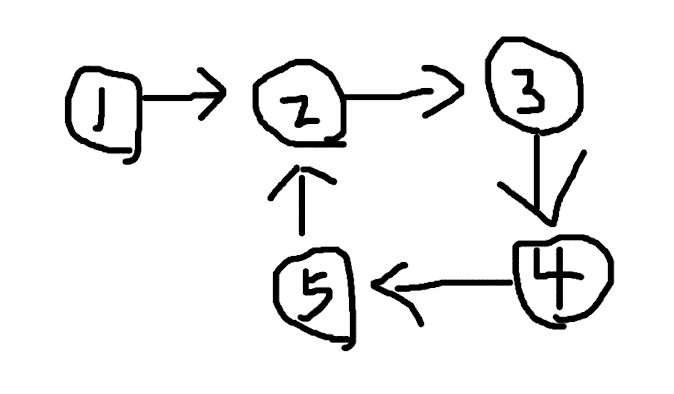

# 判断链表是否有环

### 问题

链表有环是指链表中“最后”的一个节点，它的下一个节点指向了链表中位于它之前的节点。



当程序遍历这个链表，会发现进入了死循环，永远找不到出口了。怎么判断一个链表，是否存在这样的环呢？

### 分析

常用的解决思路是双指针。设想一个在赛道上的场景，两个人 A 和 B 处于同样的起点，但是他们跑步的速度并不相同，A 的速度 v<sub>1</sub>=1，B 的速度 v<sub>2</sub>=2，也就是 B 比 A 快。在这样的情况下，只要他们不停，B 一定会超过 A 一圈然后再次追上 A，这是一种生活中的常识。


在一个圈里，一快一慢的两个点一定会再次相遇，而且他们经过的路程是可以计算的，路程 s<sub>1</sub> 和 s<sub>2</sub> 应该满足这样的关系：

```
s2 - s1 = nR
```

R 是圆圈的周长，n 是正整数，他们位于出发点时 n=0，第一次相遇的时候 B 比 A 多跑了一圈，多出了 1 倍周长的路程，n=1。

和链表的情景相比较，赛道的场景还少了开始的一段距离，在进入赛道之前，A 和 B 会先从赛道外的小路进入赛道，然后再开始绕圈跑步。他们的起点在赛道外，为了便于计算，他们的速度从始至终不发生变化，那么当他们进入赛道之后，就已经不是同样的起点了。


在这种情况下，他们经过的路程 s<sub>1</sub> 和 s<sub>2</sub> 还有规律可循吗？设圆形赛道外的直道距离为 d，相比上面的关系式，他们在圆圈内的路径依然满足 n 倍的周长 R，只不过现在的表达式不同了：

```
(s2 - d) - (s1 - d) = nR
	s2 - d - s1 + d = nR
			s2 - s1 = nR
```

结果表达式在相互抵消路径 d 之后，和之前的一样。

A 的路程 s<sub>1</sub>=v<sub>1</sub>t，B的路程 s<sub>2</sub>=v<sub>2</sub>t，时间 t 是一样的，速度 v<sub>1</sub> 和 v<sub>2</sub> 是已知的 1 和 2，有：

```
	s2 - s1 = nR
  v2t - v1t = nR
	 2t - t = nR
		  t = nR
```

取 n = 1，`t = R`。

### 解决 

回到链表的问题，其实我们只要用快慢指针就可以判断链表是否有环了，并不需要知道他们具体相遇的点在哪儿，不过计算路径关系的公式可以辅助我们验证结果的正确性。

回到这个链表，用两个指针 A 和 B 从节点 1 分别以速度 1 和 2 出发：


他们的位置关系将会是：

| 时间 t   | 0      | 1      | 2      | 3      | 4      |
| -------- | ------ | ------ | ------ | ------ | ------ |
| A 的位置 | 节点 1 | 节点 2 | 节点 3 | 节点 4 | **节点 5** |
| B 的位置 | 节点 1 | 节点 3 | 节点 5 | 节点 3 | **节点 5** |

在第 4 个时间点的时候，A 和 B 相遇了，环的周长正好等于 4，满足 `t = R` 的关系。

