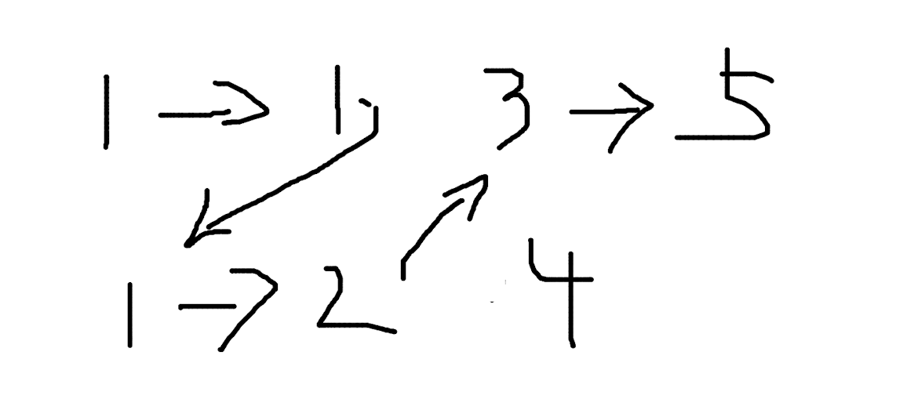

# 合并两个有序链表

### 问题


给出两个有序链表，将两个链表合并为一个有序链表。

### 分析

思路暴力简单，同时迭代两个链表，按照顺序依次合并就可以了。控制好边界条件。




### 代码

node 结构定义：

``` go
type Node struct {
	Value int
	Next  *Node
}
```

构建两条链表：

``` go
func main() {
	root1 := &Node{
		Value: 1,
	}
	root1.Next = &Node{
		Value: 1,
	}
	root1.Next.Next = &Node{
		Value: 3,
	}
	root1.Next.Next.Next = &Node{
		Value: 5,
	}

	root2 := &Node{
		Value: 1,
	}
	root2.Next = &Node{
		Value: 2,
	}
	root2.Next.Next = &Node{
		Value: 4,
	}

	root := merge(root1, root2)
	for root != nil {
		fmt.Println(root.Value)
		root = root.Next
	}
}
```

合并链表：

``` go
func merge(root1 *Node, root2 *Node) *Node {
	var root *Node
	var temp *Node
	if root1.Value <= root2.Value {
		root = root1
		temp = root2
	} else {
		root = root2
		temp = root1
	}
	p1 := root
	p2 := p1.Next
	for {
		if p2 == nil || temp == nil {
			break
		}
		if p2.Value <= temp.Value {
			p1.Next = p2
			p1 = p1.Next
			p2 = p2.Next
		} else {
			p1.Next = temp
			p1 = p1.Next
			temp = temp.Next
		}
	}
	return root
}
```

