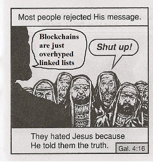

# 为什么你需要这本书

## 原因

如果你没有时间搜索和查找一些技术资料，或者没有兴趣花费大量时间去了解区块链的技术细节，但稍微好奇区块链里面到底有些什么，希望以最容易理解的方式知道区块链的全部，我会替你收集信息并且把可信至少有逻辑有道理的结论写在这里。

如果一些内容是正确的，可以省去你的精力，直接相信这些内容。如果在经过自己的思考后，发现一些内容是错误的，你可以明白我进入了哪些误区，然后轻而易举地避开这些错误，得到更加正确的结论。

在经过一段时间的实践后，也许这里的内容从 “短暂的结论” 变成了 Awesome 类型的索引。没关系吧，总之都是有价值的。

## 动机

这本书背后有另外的动机，就是作为我的书签管理器。以前尝试过一些整理的形式，比如把收藏的 paper PDF 放到 Github 上的 <https://vpb.smallyu.net>；用不同平台思维导图分类整理内容的 <http://mindmap-share.smallyu.net>；后来纯粹放几个链接的 <http://bw.smallyu.net>；个别放到 Github Gist 上的书签备份 <https://gist.github.com/smallyunet/0b54373714039833b04bfbc10d01f461>。

在尝试过这样一些方式后，经过分析和对比，仍然没有找到最合适的整理自己收藏的形式。最后选择就用书吧，顺便，有目录、有内容、可以自己写一些东西。我不会再更新那些内容，希望这里可以整合涵盖全部内容。

## 对标项目

有一些形式相似或者内容相似的项目值得一看，它们都是优秀的对标项目。

- [yjjnls/awesome-blockchain](https://github.com/yjjnls/awesome-blockchain) 是一个 star 数很高的 awesome 项目，开篇有一张非常吸引人的图片：

- [smartcontractkit/full-blockchain-solidity-course-py](https://github.com/smartcontractkit/full-blockchain-solidity-course-py) 是一个针对 beginner 的教程项目，包含了很多对基础概念的解释。

- [OffcierCia/DeFi-Developer-Road-Map](https://github.com/OffcierCia/DeFi-Developer-Road-Map) 是针对 DeFi 开发者的 roadmap 项目。

- [slowmist/Blockchain-dark-forest-selfguard-handbook](https://github.com/slowmist/Blockchain-dark-forest-selfguard-handbook) 关于资产安全，无论是新手还是老手，都值得一看。

## Q&A

### 这本书的出发点是 “教人” 吗？

当然不是，我没有资格没有资历教别人什么。这本书的出发点仅仅是我自己，出发点应该是分享，在博客、微博、Twitter 等方式之外，还有一些我想要表述但是没有合适平台的东西。

至于可能存在的一些意义，只是说服自己的理由。我知道这本书扑街的可能性很大很大。

### 这本书算 “书” 吗？

形式上算，内容上不算。没有组织、没有逻辑、结构不严谨，算不上 “书”。

### 持续完善这本书的动力是什么？

有很多很多东西我一知半解，我会顺便在这里写一点学习过程中的发现和心得，这是唯一的动力。

