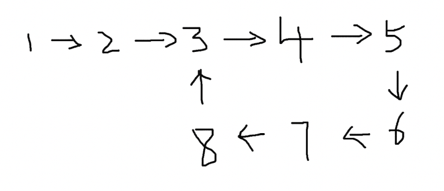
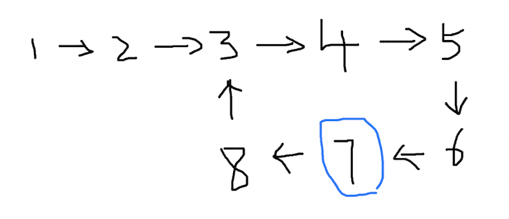
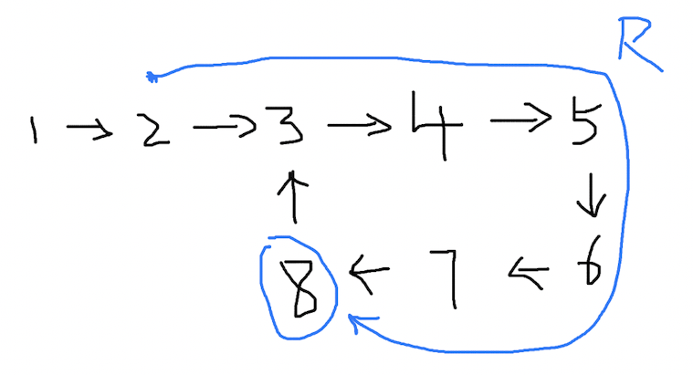
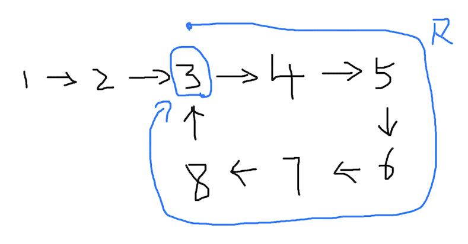
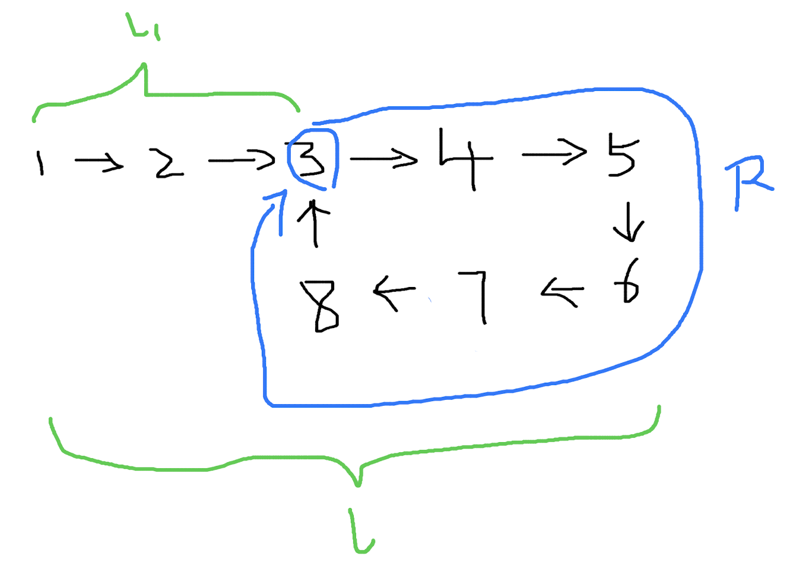

# 链表如果有环，找到环的起点

### 问题

这个问题是上一个问题的延伸，在判断链表已经有环的基础上，找到环的起点。比如这样的一个链表，环的起点是节点 3。



### 分析

（1）

在判断链表是否有环的问题中，我们得到了一个至关重要的结论：

```
t = R
```

两个快慢指针将会在等于环长度的时间点相遇。对于上图的链表，快慢指针的位置关系是这样：

| 时间 t   | 0      | 1      | 2      | 3      | 4      | 5     | 6      |
| -------- | ------ | ------ | ------ | ------ | ------ | ------ | ------ |
| A 的位置 | 节点 1 | 节点 2 | 节点 3 | 节点 4 | 节点 5 | 节点 6 | **节点 7** |
| B 的位置 | 节点 1 | 节点 3 | 节点 5 | 节点 7 | 节点 3 | 节点 5 | **节点 7** |

我们可以观察到，环的长度是 6，快慢指针也会在第 6 秒相遇，他们交点位置是节点 7:



（2）

根据上面提到的之前的结论，按照慢指针 v<sub>1</sub> = 1 的速度，它经过的路程和时间是一样的，也就是说，从出发点到两指针相遇的路径长度，根据 `t = R`，此刻的时间是 t，正好是环的长度 R：


（3）

做一个假设，慢指针保持着这个长度为 R 的走过的路径，向前移动一步，会变成这样：



再走一步，变成了这样：



（4）

到这里似乎还不知道我们要干什么。现在对路径设一个变量，从 `出发点` 到 `环的起点` 之间的距离设为 l<sub>1</sub>，整个链表的长度设为 l，环的长度仍然为 R。



这 3 个变量将满足这样的关系：

```
l - l1 = R
```

这是太显而易见的事情。

（5）

记得我们一开始的结论吗？从 `出发点` 到 `快慢指针的交点` 之间的距离，等于环的长度 R：


变量 l 和 l<sub>1</sub> 保持不变，图就成了这样：


此时的 l 仍然等于 `l1 + R`，不同的是，`l1` 和 `R` 重合了。

（6）

```
l - l1 = R
```

重合之后，等式关系还成立吗？当然成立，因为整个链表没有变，变量的大小没有变。但好像又觉得哪里奇怪。

现在新设一个变量，设从 `快慢指针的交点` 到 `环的起点` 的距离为 l<sub>2</sub>：


此时：

```
l - l2 = R
```

（7）

经过这样一些比较，发现 `l1 == l2`，也就是从 `出发点` 到 `环的起点` 的距离，等于 `快慢指针的交点` 到 `环的起点` 的距离。

### 解决

```
出发点 -> 环的起点 == 快慢指针的交点 -> 环的起点
```

这是一个很重要的结论，因为我们此时的快慢指针就在 `快慢指针的交点` 上，在节点 7 的位置。

如果这个时候在新增一个指针 p<sub>3</sub>，在快慢指针相交的时刻，从整个链表的 `出发点` 1 出发（速度为 1），那么 p<sub>3</sub> 和慢指针一定会相交，因为 p<sub>3</sub> 到 `环的起点` 的距离等于慢指针到 `环的起点` 的距离。p<sub>3</sub> 遇到慢指针的位置，就是环的起点。


